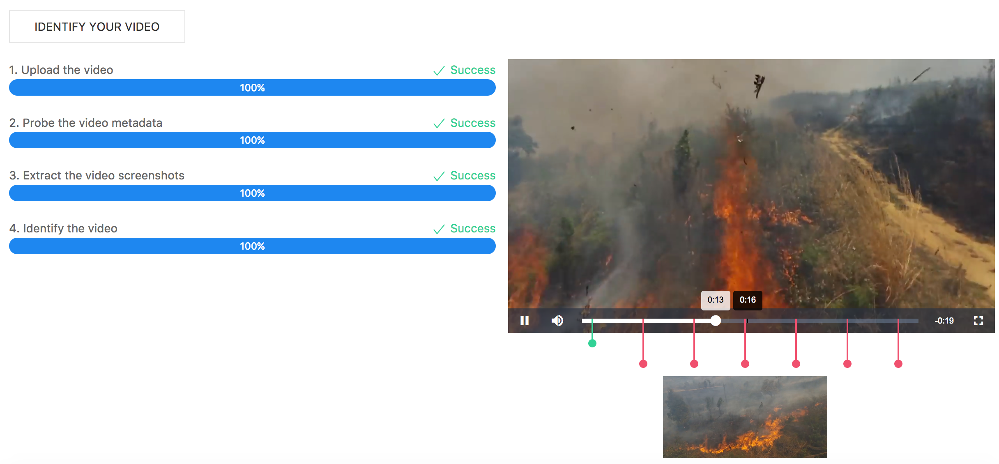

# fire-video-identification

This tool is used to identify whether there exist fire in a video.



It leverage below technology for reference:

* [Multer for uploading files](https://github.com/expressjs/multer)
* [Webpack with HMR for development](https://github.com/kenanpengyou/express-webpack-full-live-reload-example)
* [WebSocket for express](https://github.com/HenningM/express-ws)
* [Fluent ffmpeg API for node.js](https://github.com/fluent-ffmpeg/node-fluent-ffmpeg)
* [Video.js](https://github.com/videojs/video.js)
* [Video.js plugins](https://github.com/videojs/video.js/wiki/Plugins)
* [Co generator function](https://github.com/tj/co)
* [Pug loader for webpack](https://github.com/pugjs/pug-loader)
* [Compile & install FFmpeg for docker image of node](https://trac.ffmpeg.org/wiki/CompilationGuide/Ubuntu)

## Installation

1. Clone this repository and goto project directory.

2. Build app image.

	2.1. Use default context path ( / ) and AI VISION API.

	```
	$ docker build -t my-app-image .
	```

	2.2. *( Optional )* build image with special context path.

	```
	$ docker build --build-arg context=/fire -t my-app-image .
	```

	2.3. *( Optional )* or build image with special AI VISION API also.

	```
	$ docker build --build-arg context=/fire \
		--build-arg api=http://172.29.163.54:8080/AIVision/api \
		-t my-app-image .
	```

3. Start my app.

	3.1. Use default configuration.

	```
	$ docker run -d -p 8080:8080 \
		--name my-app \
		my-app-image
	```

	3.2. *( Optional )* startup with special config.

	```
	$ docker run -d -p 8080:8080 \
		-e Video_Upload_Dir=./upload \
		-e Second_Per_Capture=10 \
		-e AI_VISION_API=https://ny1.ptopenlab.com/AIVision/api \
		--name my-app \
		my-app-image
	```

4. Access url:  [http://localhost:8080](http://localhost:8080)
